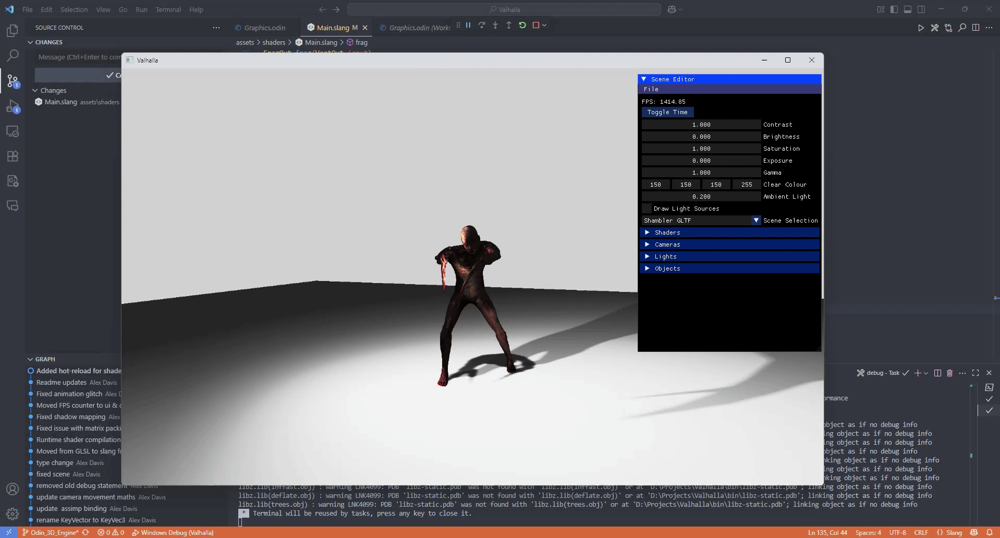

# Valhalla Graphics Engine

Valhalla is a graphics engine for rendering 3D scenes, structured as a reusable Odin package that can be imported into other projects. A demo program is included to showcase how to use the package.

## Why Valhalla?

Valhalla is an active work in progress. The project is designed to be as implementation-agnostic as possible, making it easy to integrate into a variety of Odin projects. Its modular architecture and real-time rendering features aim to support both games and visualization tools.

## Features

- Rigged 3D model and animation support
- Multiple light sources
- Custom shaders
- Shadow mapping
- Real-time rendering
- Cross-platform (Windows, Linux)
- Hot-reloadable shaders

## Project Structure

- `valhalla/` &mdash; Core graphics engine package (importable in Odin projects)
- `demo/` &mdash; Example program demonstrating usage of the Valhalla package
- `demo/assets/` &mdash; Assets used by the demo (models, shaders, textures)

## Getting Started

### Prerequisites

- [Odin](https://odin-lang.org/docs/install/) programming language
- [VulkanSDK](https://vulkan.lunarg.com/) (recommended for development)

### Setup

#### Linux

- Install [Assimp](https://github.com/assimp/assimp/releases/tag/v6.0.1) as a shared library.
- Install GLFW 3.4+ (older versions may cause crashes).

Clone the repository and build the demo program:

```sh
git clone https://github.com/xandaron/valhalla.git
cd valhalla/demo
odin build . -out:demo.exe
./demo.exe
```

> **Note:** On Linux, you will need to install the GLFW 3.4+ library separately. Anything earlier will cause crashes.

### Using the Valhalla Package in Your Project

You can import the graphics engine into your own Odin projects:

```odin
import valhalla "path/to/valhalla"
```

See the `demo/` directory for a complete example of initialization, rendering loop, and resource management.

## Demo


*A demo of a rigged 3D model and animation.*



*A demo of reloading shaders at runtime.*


*A demo of imgui in action.*

## Roadmap

Planned features and improvements:

- Improved omni-directional light shadow mapping
- Directional light support
- Expanded documentation and usage examples
- Additional rendering techniques and optimizations
- Raytracing

## Contributing

Contributions are welcome! Please open issues or pull requests for bug fixes, new features, or improvements. For major changes, discuss them in an issue first.

## Feedback

Feedback is appreciated! You can:

- Email me (address available on my GitHub profile)
- Ping me in the Odin Discord server (`@Xandaron`)
- Open an issue or discussion on GitHub

## License

This project is licensed under the MIT License.
